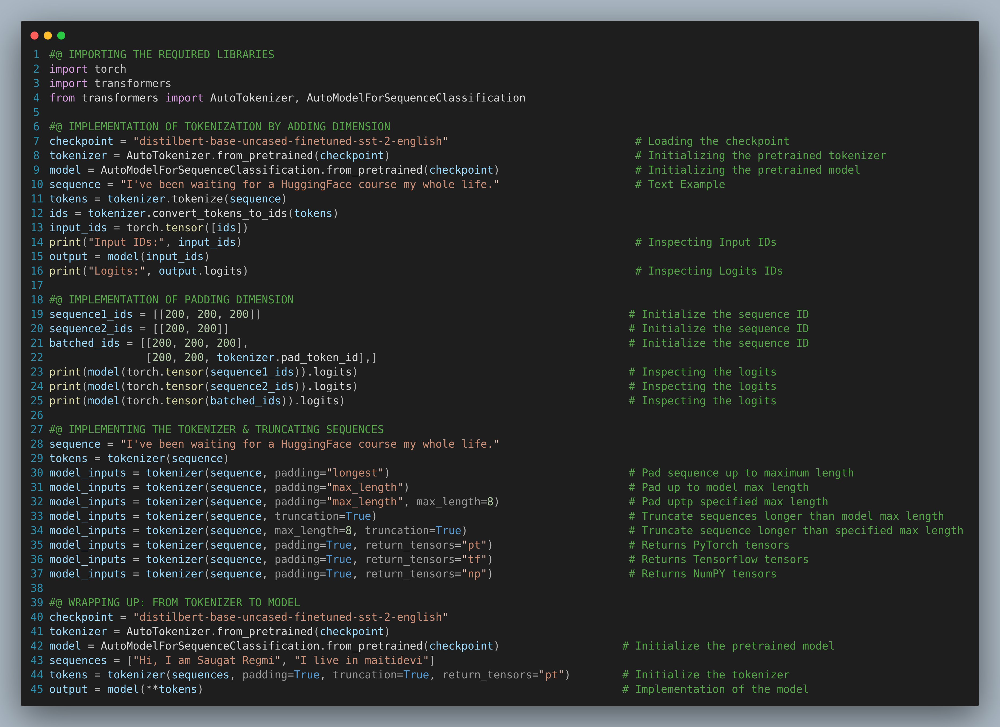

## Using Hugging Face Transformers

The [**Pipeline Function**](https://github.com/regmi-saugat/HuggingFace/blob/main/02.%20Hugging%20Face%20Transformers/Behind%20the%20Pipeline.ipynb) notebook contains the steps required for the pipeline. This pipeline serves as a well-structured pathway that transforms raw text into actionable insights, leveraging the power of Hugging Face Transformers 

**Preprocessing with tokenizers:** Our first step is to convert the text into numbers that model can understand. For this purpose, we use a `tokenizer`
- Splitting inputs into words, subwords, or symbols (like punctuations) i.e. called tokens
- Mapping each token to an integer
- Adding additional inputs that may be useful to the model
    
**Passing the inputs through the model**
- Once the input has been tokenized and mapped to integers, it's fed into the transformer model. The model processes these tokens in parallel, taking into account the positional information of each token.

**Postprocessing the outputs**
- Postprocessing involves converting these model outputs back into a human-readable format. For example, you might decode the generated token IDs into words, or extract information from the predicted labels.

---

The [**Tokenizers & Models**](https://github.com/regmi-saugat/HuggingFace/blob/main/02.%20Hugging%20Face%20Transformers/Models%20and%20Tokenizers.ipynb) notebook contains the comprehensive information about the basic buildings blocks of a Transformer model, tokenization pipeline, limitations of input IDs, attention masks, and configurable tokenizer methods.

**Tokenizers:**
- Tokenizers are one of the core components of the NLP Pipeline
- They translate text into data that can be processed by the model
- The models can only process numbers, so tokenizers need to convert our text inputs to numerical data

### Some tokenization algorithms are:

**Word-based:** It is generally very easy to setup and use with only a few rules, and it often yields decent results

Problems:
- Very large vocabularies:
- Large quantity of out-of-vocabulary tokens
- Loss of meaning across very similar words

**Character-based:** Character-based tokenizers split the text into characters, rather than words. This has two primary benefits:
- The vocabulary is much smaller
- There are much fewer out-of-vocabulary(unknown) tokens since every word can be built from characters

Problems:
- The sequences are translated into very large amounts of tokens to be processed by the model
- Less meaningful individual tokens
- This can have an impact on the size of the context the model will be around and will reduce the size of the text we can use as input for our model.

**Subword-based tokenization:** Subword-based tokenization lies between character and word-based algorithms. It relies on two principle
- Frequently used words should not be split into smaller subwords
- Rare words should be decomposed into meaningful subwords

**Encoding:**
Translating text into numbers is known as encoding. It is done in two processes: the tokenization and followed by conversion of input IDs
- The first step is to split the text into words, i.e. called tokens
- The second step is to convert tokens into numbers, so we can build a tensor out of them and feed them to the model

**Decoding:**
- Decoding is going the other: from vocabulary indices, we want to get a string. This can be done with the `decode()` method

---

