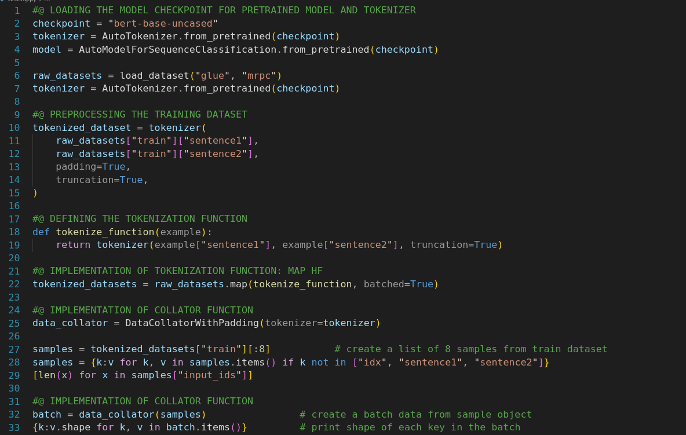
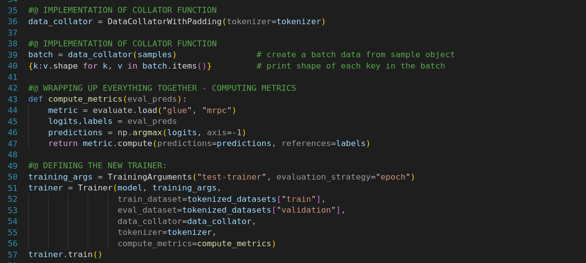

## Fine Tuning Pretrained Models

In [Fine Tuning Pretrained Model](https://github.com/regmi-saugat/HuggingFace/tree/main/03.%20Fine%20Tuninig%20Pretrained%20Model) notebook, I have experimented with *Preprocessing the Dataset*, *Dynamic Padding*, *Training and Computing Metrices of Hugging Face Transformers Models*. 

**Experiment with MRPC Dataset**
- Microsoft Research Paraphrase Corpus (MRPC) is one of the 10 datasets composing the GLUE benchmark, which is an academic benchmark that is used to measure the performance of ML models across 10 different text classification tasks. It contains several columns (sentence1, sentence2, label, and idx) and a variable number of rows, which are the number of elements in each set (so, there are 3,668 pairs of sentences in the training set, 408 in the validation set, and 1,725 in the test set).

  

**Dynamic Padding**
- Dynamic padding adapts sequence lengths to the longest one in each batch, reducing unnecessary padding and optimizing processing efficiency in tasks involving variable-length data. A collate function, part of data loading, uses dynamic padding to make sequences in a batch equal in length for efficient processing by neural networks.

  
